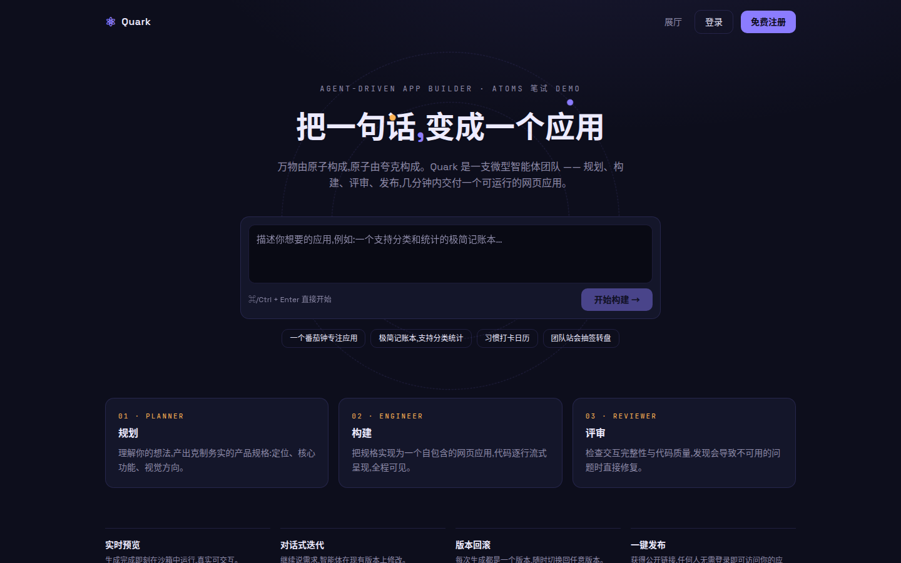
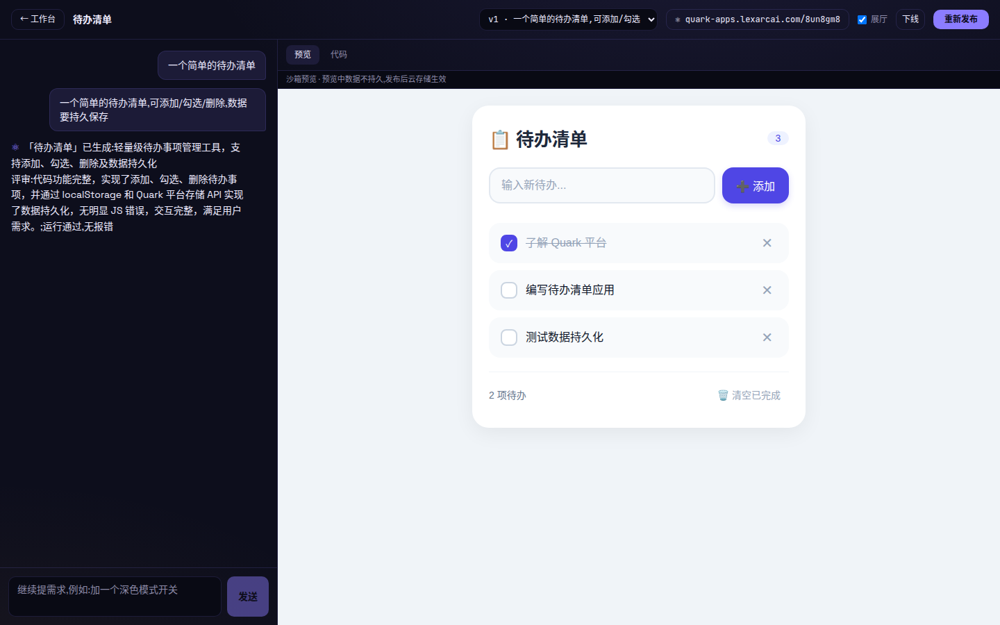
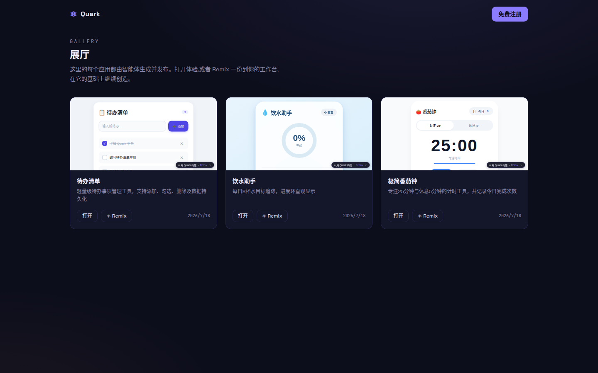
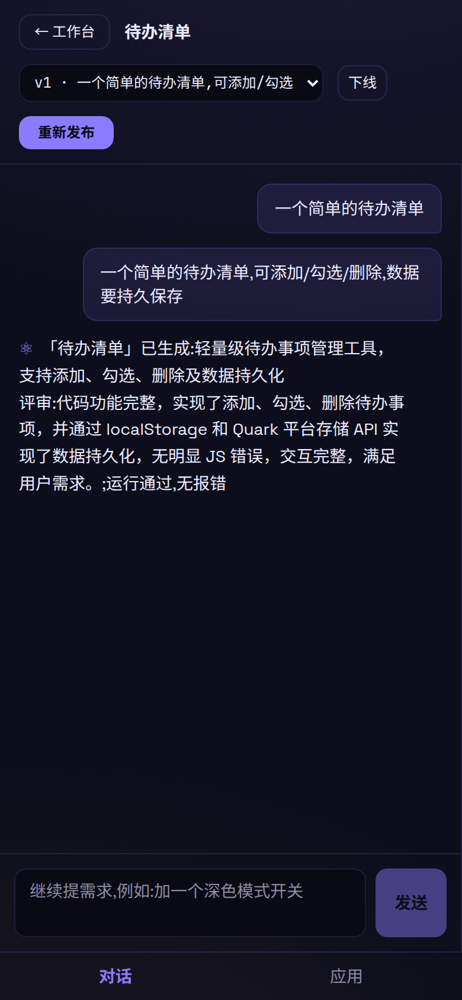
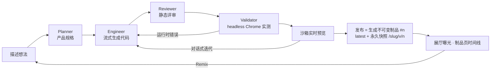

# ☀ Fusion 聚变 — 智能体驱动的应用生成平台

> ROOT / AI Native 全栈工程师笔试作品(对标 atoms.dev):用一句话描述想法,由智能体团队
> (可选 PM / Architect / Researcher,加上 Planner / Engineer / Reviewer / Validator)协作,
> 生成一个可运行、可迭代、可发布、可被 Remix 的网页或移动应用。

**在线体验链接与演示账号通过笔试文档单独提供**(生成消耗真实 LLM API 额度,不在公开页面展示)。

📄 **评审请先看:[提交说明 docs/SUBMISSION.md](docs/SUBMISSION.md)** —— 实现思路与关键取舍 · 当前完成程度(含未做边界)· 继续投入的扩展与优先级。

|  |  |
|---|---|
|  |  |

## 评审快速验收(3 分钟)

1. **免登录**:打开在线站点的 资源中心 `/resources` —— 「发现」里的每个应用都是智能体生成并发布的,可直接打开体验(注意右下角 Remix 徽章);「模板」可预览 6 个内置模板
2. **用演示账号**(免注册):用笔试文档中提供的演示账号登录 —— **全部功能开放**(可生成/迭代/发布/兑换,自带积分;因账号共享,仅不支持改密码),也可浏览示例项目的对话历史、智能体时间线产物与版本
3. **完整体验**:注册任意邮箱(无需验证)→ 首页输入一句话 → 观看智能体流水线实况(约 1-2 分钟)→ 迭代 → 发布,或从资源中心 Remix 一个现成应用改造
4. **本地验证**:`npm test` + `AGENT_MOCK=1` 模式下 `bash scripts/smoke.sh` 零成本跑通全链路(见下文)

## 核心流程



## 资源中心与部署体系

- **资源中心 `/resources`**:「发现」= 社区发布的智能体作品(可打开/Remix);「模板」= 6 个精选网站与应用模板
  (SaaS 落地页 / 作品集 / 小店展示 / 数据看板 / 习惯打卡 / 极简记账)——「使用模板」即以模板为 v1 建项目,
  之后照常对话迭代、换主题、发布部署。**模板资源同步上传到专门的 S3 bucket**(`quark-res-*`,每个模板一个
  专属 key `templates/{id}.html`),DB 记录 bucket+key
- **统一部署目标**(默认本机,多云接口预留):
  | 目标 | 状态 | 说明 |
  |---|---|---|
  | 本机 · Fusion 托管 | ✅ 默认 | 发布即部署:独立应用域,HTTPS + 云存储 + 制品体系 |
  | AWS S3 静态托管 | ✅ 可用 | 每次部署创建**专属 bucket**(`quark-app-{slug}-{rand}`)+ 网站托管,返回 S3 网站端点(HTTP);应用云存储经 **CORS** 回源继续可用;可一键下线删桶;费用按 S3 计几乎为零 |
  | Netlify | 🧪 实验性 | 用你自己的 Personal Access Token(仅本次请求使用,不存储) |
  | Vercel / CF Pages | 🗺 规划 | `DeployTarget` 适配器接口已预留 |
- **Fusion 服务本身的快速部署**:仓库带 `Dockerfile` + `docker-compose.yml`,`docker compose up -d` 即起,
  环境变量全参数化(不绑定特定云)——默认本机 systemd 运行,任意云主机可用同一镜像自托管,详见 DEPLOY.md

## 工程模式(v17 — 真实开发流程)

新项目默认以**多文件 React 工程**构建(创建时可切回 ⚡ 单文件快速模式):

- **真实工程结构**:index.html + src/*.jsx + styles.css(≤6 文件),依赖白名单
  react / react-dom(平台内置 React 19),Engineer 以文件协议流式产出、迭代只改动相关文件
- **真实构建流程**:服务端 esbuild 打包为自包含单 HTML 制品——**Build 阶段**在时间线可见,
  构建报错(文件/行号)自动喂回 Engineer 回炉修复(≤2 轮),运行时/验收失败同样做
  源码级修复→重建→复验,完整还原 代码 → 构建 → 报错 → 修复 的开发循环
- **工作台文件树**:代码页按文件 tabs 查看各源文件;发布/预览/PWA/部署等一切下游
  以构建产物为输入,与单文件模式完全一致
- **📦 导出工程**:一键下载 zip(源码 + package.json + vite 配置 + README),本地
  `npm install && npm run dev` 即可继续真实开发;移动项目附 Capacitor 配置与打 APK 指引
  (云端不打原生包,边界如实)
- 计费 +1 积分/次;Remix 与聚变会继承源应用的工程形态与源码树

## 创新四件套(v14 — 超出 Atoms 的原创能力)

- **⚛ 聚变合成(Fusion Merge)**:Remix 是复刻一个,聚变是**合并两个**——资源中心开启
  聚变模式选两个已发布应用,聚变分析师拆解两者核心能力产出合并蓝图,Engineer 以双源
  完整代码为参照**重新设计**出一个统一的新应用(信息架构/状态/视觉重构,非代码拼接);
  制品页有「用它聚变」预选入口;首次聚变生成 +2 积分
- **✅ 验收驱动验证**:团队模式 PM 的验收标准不再只是文案——Validator 把它们编译成
  声明式交互测试(点击/输入/断言,**LLM 产出的是数据而非可执行代码**,白名单动作沙箱执行),
  headless Chrome 逐条真实操作应用;失败项自动回炉修复一轮并复测;逐条 ✓/✗/○ 验收清单
  入档对话流,形成「需求 → 验收标准 → 真机实测」的完整闭环
- **📣 反馈闭环 + 应用自愈**:发布应用自带 💬 访客反馈组件与运行时错误上报(会话内去重);
  工作台「运营」面板汇聚真实访客的声音与线上报错,属主勾选后一键「吸收反馈生成新版本」
  或「修复报错」——生成 → 发布 → 被使用 → 反馈回流 → 再进化,产品生命周期在发布后继续。
  (自愈采取属主一键批准而非全自动,成本与安全考虑,如实说明)
- **🎯 指哪改哪**:预览里点选任意元素(hover 高亮),该元素的 CSS 路径与代码片段注入
  本次迭代上下文,Engineer 被约束只围绕它做外科手术式修改——告别「改个按钮却重写全页」;
  检查器只存在于工作台预览,发布产物不含

## 团队模式与构建目标

- **👥 团队模式**(生成开关):流水线扩编为智能体团队 —— **PM** 把想法细化为需求单(用户目标/
  用户故事/验收标准)→ **Architect** 产出界面架构蓝图(信息架构/组件/状态与数据流)→ Engineer 据此实现;
  迭代时由 Architect 出「变更蓝图」。需求单与蓝图以卡片形式留档在对话里,时间线逐阶段标注所用模型
- **构建目标**:创建时选择 🌐 网页 / 📱 移动,项目内可随时点击平台徽标**切换目标**——下次生成按新目标
  规范执行,预览形态(手机框)与发布形态(PWA)自动跟随

## 模型选择与混合模型构建

生成前可选三档模式(工作台输入区),流水线**按阶段混用模型**,时间线实时标注每个阶段用了哪个模型:

| 模式 | Researcher/Planner/Reviewer | Engineer(流式编码) | 适用 |
|---|---|---|---|
| ⚡ 快速(默认) | V4 Flash 非思考 | V4 Flash 非思考 | 日常迭代,最快 |
| 🧠 混合 | V4 Flash **思考模式** | V4 Flash 非思考(写得快) | 复杂需求首次生成,思考与速度兼得 |
| 🐢 深度 | V4 Flash 思考模式 | V4 Flash 思考模式 | 最强推理,最慢 |

底层为 DeepSeek V4 Flash 单模型,思考/非思考经 `thinking` 请求参数切换(2026-07-24 起
`deepseek-chat`/`deepseek-reasoner` 旧名弃用,已完成迁移并保留旧名兼容映射);模型注册表
(`src/lib/models.ts`)结构化预留扩展位;思考过程(reasoning_content)不进入产物。
构建完成自动切换预览;若停留在代码页会出现「✓ 新版本已生成 → 查看预览」,移动端「应用」tab 显示完成绿点。

## 附件 · 深度研究 · 主题变换

- **📎 附件上传**(工作台输入区):文本/数据文件(txt/md/csv/json ≤64KB)全文进入智能体上下文 ——
  传一份 CSV 就能生成围绕这份数据的应用;图片(png/jpg/webp/svg ≤512KB)作为资源内嵌 —— Engineer 以
  `asset://文件名` 引用,发布前服务端替换为 data URI,版本保持自包含。每项目 ≤6 个。
  (DeepSeek 为纯文本模型,图片仅作资源使用、不做视觉理解 —— 如实说明)
- **🔬 深度研究**(生成开关):Researcher 智能体在规划前做领域分析(目标用户/同类产品模式/必备与加分
  功能/风险),产出结构化研究简报注入 Planner;需求中出现的公开链接会被抓取纳入研究
  (服务端 SSRF 防护:DNS 解析后拒绝私网/环回/link-local/元数据地址)。未接入搜索 API,
  信息源 = LLM 知识 + 用户提供的链接 —— 边界如实。
- **🎨 主题(项目属性,持续生效)**:创建时或工作台随时选定主题(深色/浅色/多巴胺/莫兰迪/像素复古/
  极简黑白/毛玻璃),落库为项目属性 —— 此后**每次生成与迭代**都由服务端注入主题规范,视觉始终一致;
  换主题即改属性并触发一次纯视觉迭代(功能文案不变,新版本可回滚),可随时清除恢复默认。
- **🎙 语音输入**(首页与工作台):基于浏览器 Web Speech API 的中文语音转文字,点击说话、再点停止;
  不支持的浏览器给出明确提示(建议 Chrome)。纯前端能力,录音不经过服务器。

## 移动应用工作流与 PWA 制品

新建项目时可选 **📱 移动应用**,整条链路随之切换:

- **生成工作流**:Planner 以单手主流程/层级 ≤3/离线可用产规格;Engineer 追加移动规则(390px 竖屏优先、
  `viewport-fit=cover` + 安全区、触控目标 ≥44px、禁 hover 依赖、底部拇指区、`theme-color`/apple meta);
  Validator 以 **390×844 触屏视口**真实运行检验;工作台预览渲染在手机框中
- **移动制品 = 可安装 PWA**:发布时服务端自动注入 manifest + Service Worker(navigate 离线回退,
  缓存随新制品发布自动失效)——iOS(Safari 分享→添加到主屏幕)与 Android(Chrome 安装应用)均可装到桌面、
  离线打开,数据走云存储;制品页提供**二维码扫码真机安装**与双端指引;快照页不注册 SW(仅 latest 可安装)
- **边界(诚实说明)**:manifest 图标为 SVG(极旧 Android 上安装横幅可能不出现,可手动添加到主屏幕);
  原生 IPA 需 macOS 构建机、APK 需云构建产线,均列为扩展方向而非本期范围

## 制品(Artifact)

发布采用 **registry 语义**:开发版本(v1…vN)是工作台内部概念,**每次发布会产出一个不可变制品**(#1、#2…):

- `apps 域/{slug}` — 恒指 **latest**;`apps 域/{slug}/v/{n}` — 第 n 号制品的**永久快照**,可独立分享
- 制品页 `/artifact/{slug}`(公开):发布历史时间线,任意快照打开 / Remix;属主可**一键把 latest 回滚**到任意历史制品(指针切换,不产生新序号)
- 重复发布同一版本是 no-op;取消发布后 latest 与全部快照一并下线(隐私优先),重新发布即恢复且序号续增
- 应用云存储按项目共享,快照之间数据连续

- **真实交互**:生成的应用在沙箱 iframe 中即刻可用;平台本身的注册、项目管理、生成、发布全部真实落库。
- **数据持久化**:SQLite(用户 / 会话 / 项目 / 消息 / 应用版本五张表),服务重启数据不丢。
- **延展能力**(两项):
  1. **一键发布** —— 每个应用获得公开 URL `/p/{slug}`,任何人无需登录可访问(对应 Atoms 的 one-click deploy);
  2. **版本历史与回滚** —— 每次生成都是一个不可变版本,可随时切换,迭代基于当前选中版本进行。

## 实现思路与关键取舍

| 决策 | 取舍理由 |
|---|---|
| 单文件 HTML 作为生成产物(v1-v16)→ v17 起「文件树 + 构建产物」 | 早期单文件自包含使预览/存储/发布退化为一个字符串的读写;v17 保留该契约但把它变成**构建产物**:多文件源码经 esbuild 打包,下游链路零改动,真实开发流程与简单架构兼得 |
| 三智能体流水线而非单次 prompt | 还原 Atoms 的多智能体工作感,且各阶段职责单一:Planner 控制范围蔓延,Reviewer 兜底可用性;SSE 把每个阶段与代码逐 token 推到前端,过程可见 |
| Next.js 单体全栈 + SQLite(`node:sqlite`) | 一个进程覆盖 UI/API/静态服务;Node 24 内置 SQLite,零 ORM、零原生依赖,部署面最小。规模上去后再谈拆分 |
| 自研轻量 Auth(scrypt + httpOnly cookie) | 演示规模下引入 NextAuth/Clerk 属于过度设计;`node:crypto` 的 scrypt + 会话表 40 行解决 |
| LLM 用 DeepSeek(OpenAI 兼容) | 代码生成质量/价格比合适;客户端只依赖 `fetch`,换任何 OpenAI 兼容模型只改两个环境变量 |
| 生成应用的数据:云 KV 优先,localStorage 兜底 | v2 注入 `window.quark.storage`(服务端 KV,访客共享)对标 Atoms Cloud;注入发生在发布服务侧而非生成物内,版本数据保持纯净 |
| 发布应用独立源 + 无鉴权公共 KV | 用户生成代码是不可信输入,必须与平台 cookie/origin 隔离;KV 公共写是"多人共享小应用"的产品选择,以容量/键数/限流约束风险 |

## 当前完成程度

v1(6-8h 笔试窗口内):

- [x] 注册 / 登录 / 会话(scrypt 哈希,httpOnly cookie)
- [x] 项目 Dashboard(列表 / 新建 / 删除)
- [x] Planner → Engineer → Reviewer 流水线,SSE 流式输出(阶段时间线 + 代码实况)
- [x] 沙箱 iframe 实时预览,预览/代码双视图;对话式迭代;版本历史与回滚
- [x] 一键发布 / 更新发布;生产部署(systemd + Caddy 自动 HTTPS)

v2(生产化改造,对应下方原扩展优先级 1-3 全部落地):

- [x] **生成作业化**:任务落库 + 进程内队列(并发上限 2),SSE 断线重连自动续传(缓冲重放),刷新页面不丢进度;服务重启的中断任务落为明确失败态
- [x] **Validator 阶段**:headless Chrome 真实加载产物,捕获运行时异常/console.error,失败自动回炉一轮修复并复验
- [x] **应用云存储**(对标 Atoms Cloud):发布应用注入 `window.quark.storage`(服务端 KV,全部访客共享,8KB/值、64 键/应用),换设备数据仍在;不可用时自动降级 localStorage
- [x] **安全**:发布应用迁移到独立应用域(与平台 cookie/origin 隔离);预览 iframe 去除 `allow-same-origin`;登录/注册限流 10 次/分/IP;生成限流 3 次/10 分 + 24h 配额 30 次/用户;变更类 API Origin 校验
- [x] **可运维**:`/api/health`、SQLite 每日备份(保留 14 份)、vitest 单测+集成(11 例)、mock 流水线(`AGENT_MOCK=1`)、e2e 冒烟脚本、GitHub Actions CI

v3(体验与产品闭环):

- [x] 移动端双 tab 工作台;SSE 断流自动重连;失败一键重试;取消发布;项目重命名
- [x] **展厅 + Remix 闭环**:已发布应用进入公开展厅 `/explore`(可关闭),任何人可一键 Remix 到自己的
  工作台继续创造;发布应用带可关闭的归属徽章 —— 生成 → 发布 → 被发现 → 被再创造
- [x] 演示账号降低评审门槛(现已全功能开放,仅不可改密码);品牌 favicon;autocomplete 等细节

剩余已知局限:

- 生成产物限单文件 HTML,不支持多文件项目与外部依赖
- 队列在进程内(单机部署),横向扩展需外置队列与共享事件流
- 未做邮箱验证/找回密码(SES 尚在沙箱);KV 为公共写(按应用隔离 + 限流 + 容量上限)

## 如果继续投入,如何扩展(按优先级)

1. ~~**多文件产物与依赖白名单**~~:✅ v17 已落地(工程模式:多文件 React + esbuild 构建 + 构建错误回炉 + 工程导出);
2. **Race Mode**:同一 prompt 并发多模型生成,并排预览择优(对标 Atoms Race Mode);
3. ~~**Validator 深化**~~:✅ v14 已落地(验收驱动验证:PM 验收标准 → 交互测试 DSL → Chrome 真实执行 → 失败回炉);
4. **多进程/多机扩展**:队列外置(Redis/SQLite WAL 轮询),SSE 事件流走 pub/sub;
5. **账号完善**:邮箱验证、找回密码、KV 写鉴权(应用级 token)。

## 技术栈与架构

- Next.js 16(App Router)+ React 19 + TypeScript + Tailwind v4
- Node 24 内置 `node:sqlite`(WAL),无 ORM;`node:crypto` scrypt 做口令哈希
- DeepSeek API(OpenAI 兼容),服务端 `fetch` 直连,SSE 转发;puppeteer-core + 系统 Chrome 做运行时校验
- 部署:systemd 托管 `next start`,Caddy 反代 + Let's Encrypt 自动证书;双域名(平台 / 发布应用)同进程按 Host 分流
- 测试:vitest(单测 + job 集成)+ mock 流水线 + bash e2e 冒烟;GitHub Actions CI

```
src/
  proxy.ts      按 Host 分流 apps 域 · /p/* 301 · 变更类 API Origin 校验
  lib/          db.ts(schema)· auth.ts(会话)· agent.ts(四段流水线+mock)
                jobs.ts(队列/缓冲重放)· validate.ts(headless Chrome)· ratelimit.ts
  app/
    api/        auth/* · projects/*(CRUD · generate→job · publish · rollback)
                jobs/[id]/stream(SSE 重放+实时) · apps/[slug]/kv/[key] · health
    p/[slug]/   已发布应用(注入 window.quark.storage 后原样输出)
    project/[id]  构建工作台(对话 + 智能体时间线 + 预览/代码)
    dashboard/  项目列表    login/ register/  landing
tests/  scripts/smoke.sh  .github/workflows/ci.yml
```

## 本地运行

```bash
npm install
echo 'DEEPSEEK_API_KEY=sk-...' > .env   # 任何 OpenAI 兼容模型:另设 DEEPSEEK_API_URL / DEEPSEEK_MODEL
npm run dev
```

打开 http://localhost:3000,注册后即可生成。数据落在 `./data/quark.db`。

---

*本项目按笔试要求以 vibe coding 方式完成:Claude Code(Fable 5)全程驱动 —— 规划、编码、冒烟测试、部署、文档,人工只做方向决策。版本演进见 [CHANGELOG.md](CHANGELOG.md)。*
