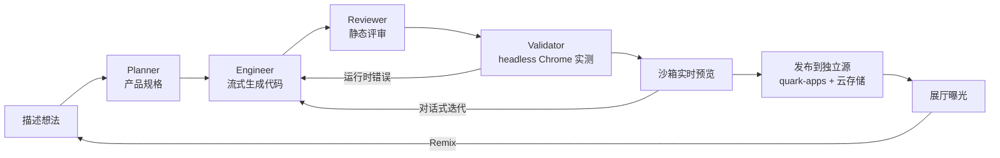

# ⚛ Quark — 智能体驱动的应用生成平台

> ROOT / AI Native 全栈工程师笔试作品。万物由原子构成,原子由夸克构成 —— Quark 是 Atoms 的"基本粒子版":
> 用一句话描述想法,由 Planner / Engineer / Reviewer / Validator 四个智能体协作,生成一个可运行、可迭代、可发布、可被 Remix 的网页应用。

**在线体验:<https://quark.lexarcai.com>**

|  |  |
|---|---|
|  |  |

## 评审快速验收(3 分钟)

1. **免登录**:打开 [展厅 /explore](https://quark.lexarcai.com/explore) —— 每个应用都是智能体生成并发布的,可直接打开体验(注意右下角 Remix 徽章)
2. **看工作台**(免注册):演示账号 `demo@quark.dev / quark123`(只读),登录后可浏览示例项目的对话历史、智能体时间线产物、版本列表与预览
3. **完整体验**:注册任意邮箱(无需验证)→ 首页输入一句话 → 观看 Planner→Engineer→Reviewer→Validator 流水线实况(约 1-2 分钟)→ 迭代 → 发布,或从展厅 Remix 一个现成应用改造
4. **本地验证**:`npm test`(11 例)+ `AGENT_MOCK=1` 模式下 `bash scripts/smoke.sh` 零成本跑通全链路(见下文)

## 核心流程



- **真实交互**:生成的应用在沙箱 iframe 中即刻可用;平台本身的注册、项目管理、生成、发布全部真实落库。
- **数据持久化**:SQLite(用户 / 会话 / 项目 / 消息 / 应用版本五张表),服务重启数据不丢。
- **延展能力**(两项):
  1. **一键发布** —— 每个应用获得公开 URL `/p/{slug}`,任何人无需登录可访问(对应 Atoms 的 one-click deploy);
  2. **版本历史与回滚** —— 每次生成都是一个不可变版本,可随时切换,迭代基于当前选中版本进行。

## 实现思路与关键取舍

| 决策 | 取舍理由 |
|---|---|
| 单文件 HTML 作为生成产物 | 6-8h 内"可运行、可发布"优先于"多文件工程"。单文件自包含(禁外链资源)使沙箱预览、版本存储、公开发布都退化为一个字符串的读写,复杂度骤降;代价是生成物规模有上限 |
| 三智能体流水线而非单次 prompt | 还原 Atoms 的多智能体工作感,且各阶段职责单一:Planner 控制范围蔓延,Reviewer 兜底可用性;SSE 把每个阶段与代码逐 token 推到前端,过程可见 |
| Next.js 单体全栈 + SQLite(`node:sqlite`) | 一个进程覆盖 UI/API/静态服务;Node 24 内置 SQLite,零 ORM、零原生依赖,部署面最小。规模上去后再谈拆分 |
| 自研轻量 Auth(scrypt + httpOnly cookie) | 演示规模下引入 NextAuth/Clerk 属于过度设计;`node:crypto` 的 scrypt + 会话表 40 行解决 |
| LLM 用 DeepSeek(OpenAI 兼容) | 代码生成质量/价格比合适;客户端只依赖 `fetch`,换任何 OpenAI 兼容模型只改两个环境变量 |
| 生成应用的数据:云 KV 优先,localStorage 兜底 | v2 注入 `window.quark.storage`(服务端 KV,访客共享)对标 Atoms Cloud;注入发生在发布服务侧而非生成物内,版本数据保持纯净 |
| 发布应用独立源 + 无鉴权公共 KV | 用户生成代码是不可信输入,必须与平台 cookie/origin 隔离;KV 公共写是"多人共享小应用"的产品选择,以容量/键数/限流约束风险 |

## 当前完成程度

v1(6-8h 笔试窗口内):

- [x] 注册 / 登录 / 会话(scrypt 哈希,httpOnly cookie)
- [x] 项目 Dashboard(列表 / 新建 / 删除)
- [x] Planner → Engineer → Reviewer 流水线,SSE 流式输出(阶段时间线 + 代码实况)
- [x] 沙箱 iframe 实时预览,预览/代码双视图;对话式迭代;版本历史与回滚
- [x] 一键发布 / 更新发布;生产部署(systemd + Caddy 自动 HTTPS)

v2(生产化改造,对应下方原扩展优先级 1-3 全部落地):

- [x] **生成作业化**:任务落库 + 进程内队列(并发上限 2),SSE 断线重连自动续传(缓冲重放),刷新页面不丢进度;服务重启的中断任务落为明确失败态
- [x] **Validator 阶段**:headless Chrome 真实加载产物,捕获运行时异常/console.error,失败自动回炉一轮修复并复验
- [x] **应用云存储**(对标 Atoms Cloud):发布应用注入 `window.quark.storage`(服务端 KV,全部访客共享,8KB/值、64 键/应用),换设备数据仍在;不可用时自动降级 localStorage
- [x] **安全**:发布应用迁移到独立源 `quark-apps.lexarcai.com`(与平台 cookie/origin 隔离);预览 iframe 去除 `allow-same-origin`;登录/注册限流 10 次/分/IP;生成限流 3 次/10 分 + 24h 配额 30 次/用户;变更类 API Origin 校验
- [x] **可运维**:`/api/health`、SQLite 每日备份(保留 14 份)、vitest 单测+集成(11 例)、mock 流水线(`AGENT_MOCK=1`)、e2e 冒烟脚本、GitHub Actions CI

v3(体验与产品闭环):

- [x] 移动端双 tab 工作台;SSE 断流自动重连;失败一键重试;取消发布;项目重命名
- [x] **展厅 + Remix 闭环**:已发布应用进入公开展厅 `/explore`(可关闭),任何人可一键 Remix 到自己的
  工作台继续创造;发布应用带可关闭的归属徽章 —— 生成 → 发布 → 被发现 → 被再创造
- [x] 演示账号(只读)降低评审门槛;品牌 favicon;autocomplete 等细节

剩余已知局限:

- 生成产物限单文件 HTML,不支持多文件项目与外部依赖
- 队列在进程内(单机部署),横向扩展需外置队列与共享事件流
- 未做邮箱验证/找回密码(SES 尚在沙箱);KV 为公共写(按应用隔离 + 限流 + 容量上限)

## 如果继续投入,如何扩展(按优先级)

1. **多文件产物与依赖白名单**:esbuild 服务端打包,支持 React/组件级生成;
2. **Race Mode**:同一 prompt 并发多模型生成,并排预览择优(对标 Atoms Race Mode);
3. **Validator 深化**:关键交互脚本自动生成并执行(点击主按钮、断言状态变化),不止于加载无报错;
4. **多进程/多机扩展**:队列外置(Redis/SQLite WAL 轮询),SSE 事件流走 pub/sub;
5. **账号完善**:邮箱验证、找回密码、KV 写鉴权(应用级 token)。

## 技术栈与架构

- Next.js 16(App Router)+ React 19 + TypeScript + Tailwind v4
- Node 24 内置 `node:sqlite`(WAL),无 ORM;`node:crypto` scrypt 做口令哈希
- DeepSeek API(OpenAI 兼容),服务端 `fetch` 直连,SSE 转发;puppeteer-core + 系统 Chrome 做运行时校验
- 部署:systemd 托管 `next start`,Caddy 反代 + Let's Encrypt 自动证书;双域名(平台 / 发布应用)同进程按 Host 分流
- 测试:vitest(单测 + job 集成)+ mock 流水线 + bash e2e 冒烟;GitHub Actions CI

```
src/
  proxy.ts      按 Host 分流 apps 域 · /p/* 301 · 变更类 API Origin 校验
  lib/          db.ts(schema)· auth.ts(会话)· agent.ts(四段流水线+mock)
                jobs.ts(队列/缓冲重放)· validate.ts(headless Chrome)· ratelimit.ts
  app/
    api/        auth/* · projects/*(CRUD · generate→job · publish · rollback)
                jobs/[id]/stream(SSE 重放+实时) · apps/[slug]/kv/[key] · health
    p/[slug]/   已发布应用(注入 window.quark.storage 后原样输出)
    project/[id]  构建工作台(对话 + 智能体时间线 + 预览/代码)
    dashboard/  项目列表    login/ register/  landing
tests/  scripts/smoke.sh  .github/workflows/ci.yml
```

## 本地运行

```bash
npm install
echo 'DEEPSEEK_API_KEY=sk-...' > .env   # 任何 OpenAI 兼容模型:另设 DEEPSEEK_API_URL / DEEPSEEK_MODEL
npm run dev
```

打开 http://localhost:3000,注册后即可生成。数据落在 `./data/quark.db`。

---

*本项目按笔试要求以 vibe coding 方式完成:Claude Code(Fable 5)全程驱动 —— 规划、编码、冒烟测试、部署、文档,人工只做方向决策。版本演进见 [CHANGELOG.md](CHANGELOG.md)。*
